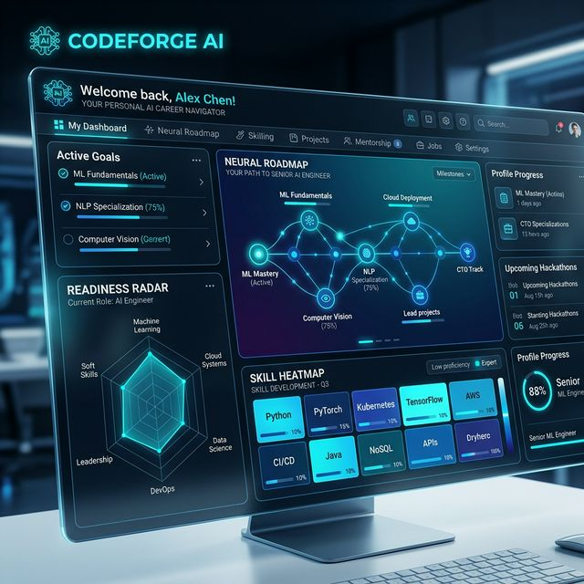
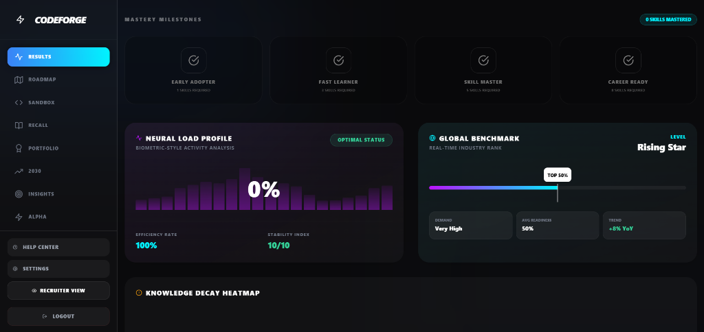
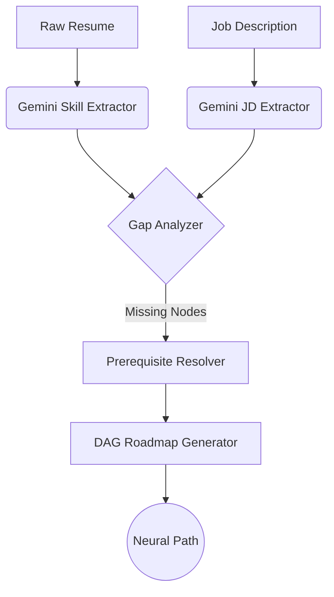
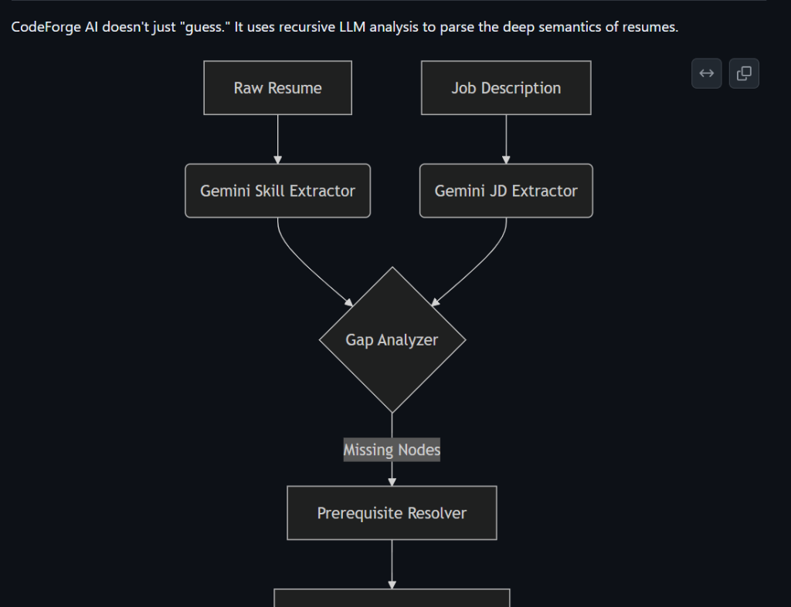
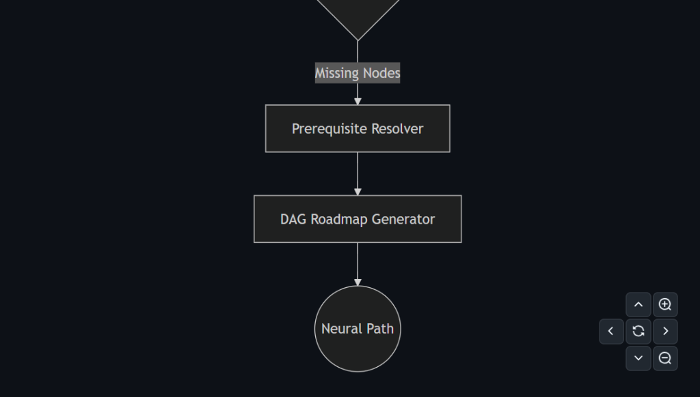

<div align="center">

# 🛠️ CodeForge AI

### **Adaptive Career Intelligence & Neural Roadmap Engine**



[](https://art-park-code-forge-hackathon-nine.vercel.app/)
[](https://artpark-codeforge-hackathon.onrender.com)
[](https://fastapi.tiangolo.com)
[](https://ai.google.dev)
[](https://python.org)

<br/>

> **"Surgically extract skill gaps and build your path to mastery."**
> CodeForge AI uses **Google Gemini 2.0 Flash** to bridge the gap between your resume and your dream job with a DAG-powered adaptive roadmap.

[**Explore the Live App →**](https://art-park-code-forge-hackathon-nine.vercel.app/)

---

### 🏆 IISc × ArtPark CodeForge Hackathon 2026

</div>

---

## 🛑 The Problem

Most career platforms offer generic advice.
- **Resumes** are often misaligned with modern **Job Descriptions (JDs)**.
- **Learning paths** lack structure, leading to "tutorial hell."
- **Skill gaps** are invisible until you fail an interview.

## ✅ The Solution: CodeForge AI

CodeForge AI provides a **precision instrument** for career growth:
1.  **Semantic Gap Analysis**: LLM-powered comparison that understands *concepts*, not just keywords.
2.  **Topological Roadmaps**: A Directed Acyclic Graph (DAG) ensure you learn prerequisites first.
3.  **Real-time Readiness Score**: A dynamic metric that updates as you master new skills.

---

## 💎 Key Features

<div align="center">

| 🧠 **Neural Roadmap** | 📊 **Gap Analytics** | 💻 **AI Sandbox** |
|---|---|---|
| DAG-based topological sorting for prerequisite-first learning. | 6-axis spider charts and depth/breadth scoring. | Real-time coding editor with an AI pair programmer. |

| 🃏 **Active Recall** | 🏆 **Dynamic Portfolio** | 🔊 **Voice Briefs** |
|---|---|---|
| Auto-generated AI flashcards for every skill in your resume. | Self-upgrading portfolio with AI-written project studies. | Audio briefings generated directly from your learning path. |

</div>

---

## 🚀 Live Environment

| Service | Environment | Endpoint |
|---|---|---|
| **Frontend UI** | Vercel | [art-park-code-forge-hackathon-nine.vercel.app](https://art-park-code-forge-hackathon-nine.vercel.app/) |
| **Backend API** | Render | [artpark-codeforge-hackathon.onrender.com](https://artpark-codeforge-hackathon.onrender.com) |
| **API Docs** | Swagger | [/docs](https://artpark-codeforge-hackathon.onrender.com/docs) |

---

## 📊 Sample Dashboard & Results



---

## ⚙️ Technical Deep Dive

### 🔬 The DAG Algorithm
We store skills as nodes in a **Directed Acyclic Graph (DAG)**. When a gap is identified:
- The engine performs a **Topological Sort** (Kahn's Algorithm) on the required skills.
- It recursively discovers and injects missing prerequisites into your roadmap.
- This ensures a logically sound learning sequence (e.g., *Variables* → *Functions* → *APIs*).

#### 🧬 Logic Flow Diagram


#### 🖼️ Architecture Screenshots
<div align="center">
  
  
</div>

### 📈 Readiness Logic
Your **Readiness Score** is calculated using a weighted formula:
$$Score = \frac{K + (0.5 \times P)}{T} \times 100$$
*(K=Known, P=Partial, T=Total Required)*

---

## 📂 Complete Folder Structure

```
ArtPark_CodeForge_Hackathon/
│
├── README.md                          # This file
├── backend/
│   ├── app/
│   │   ├── main.py                    # FastAPI app backbone
│   │   ├── models/                    # Pydantic schemas
│   │   ├── routes/                    # Modular API routing
│   │   ├── services/                  # Core AI & Business Logic
│   │   │   ├── skill_extractor.py     # Gemini Skill Extraction
│   │   │   ├── gap_analyzer.py        # Gap Scoring (Fuzzy Match)
│   │   │   └── learning_path_generator.py # DAG-powered Pathing
│   │   └── datasets/                  # Curated Skill Knowledge Base
│   ├── requirements.txt               # Backend Dependencies
│   └── .env                           # API Keys (Gitignored)
│
└── frontend/
    ├── src/
    │   ├── App.jsx                    # Core State & Logic
    │   ├── components/                # 46+ Atomic UI Units
    │   │   ├── NeuralRoadmap.jsx      # SVG Graph Rendering
    │   │   ├── GapAnalysis.jsx        # Data Viz Layout
    │   │   └── CodingSandbox.jsx      # Pair Programmer Hook
    │   └── assets/                    # Design Tokens
    ├── package.json                   # UI Dependencies
    └── vite.config.js                 # Dev Server Config
```

---

## 🔮 Future Roadmap

- [ ] **Mobile Neural Hub**: Native iOS/Android app for on-the-go learning.
- [ ] **GitHub Integration**: Automatically sync roadmap progress with your GitHub contributions.
- [ ] **Multi-Model Support**: Expand beyond Gemini to support Claude and GPT-4o.
- [ ] **Enterprise HR Portal**: Collaborative hiring dashboards for technical teams.

---

## 🛠️ Quick Start (Developer Mode)

1. **Clone**: `git clone https://github.com/priyabratasahoo780/Resume-generater.git`
2. **Backend**: `pip install -r requirements.txt` & `uvicorn app.main:app`
3. **Frontend**: `npm install` & `npm run dev`

---

<div align="center">

Built with ⚡ by **Team Invisible.Coding** for the **ArtPark CodeForge Hackathon 2026**

[](https://github.com/priyabratasahoo780/Resume-generater)

</div>
