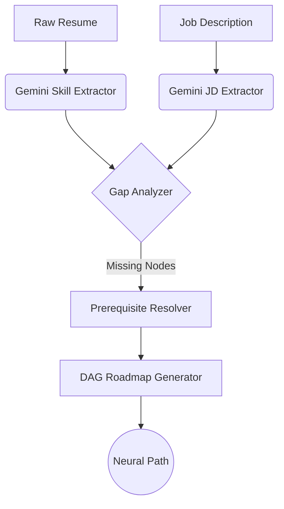

<div align="center">

# 🛠️ CodeForge AI

### **Adaptive Career Intelligence & Neural Roadmap Engine**


[](https://art-park-code-forge-hackathon-nine.vercel.app/)
[](https://artpark-codeforge-hackathon.onrender.com)
[](https://fastapi.tiangolo.com)
[](https://ai.google.dev)

<br/>

> **"Surgically extract skill gaps and build your path to mastery."**
> CodeForge AI uses **Google Gemini 2.0 Flash** to bridge the gap between your resume and your dream job with a DAG-powered adaptive roadmap.

[**Explore the Live App →**](https://art-park-code-forge-hackathon-nine.vercel.app/)

---

### 🏆 IISc × ArtPark CodeForge Hackathon 2026

</div>

---

## 💎 Key Features

<div align="center">

| 🧠 **Neural Roadmap** | 📊 **Gap Analytics** | 💻 **AI Sandbox** |
|---|---|---|
| DAG-based topological sorting for prerequisite-first learning. | 6-axis spider charts and depth/breadth scoring. | Real-time coding editor with an AI pair programmer. |

| 🃏 **Active Recall** | 🏆 **Dynamic Portfolio** | 🔊 **Voice Briefs** |
|---|---|---|
| Auto-generated AI flashcards for every skill in your resume. | Self-upgrading portfolio with AI-written project studies. | Audio briefings generated directly from your learning path. |

</div>

---

## 🚀 Live Environment

| Service | Environment | Endpoint |
|---|---|---|
| **Frontend UI** | Vercel | [art-park-code-forge-hackathon-nine.vercel.app](https://art-park-code-forge-hackathon-nine.vercel.app/) |
| **Backend API** | Render | [artpark-codeforge-hackathon.onrender.com](https://artpark-codeforge-hackathon.onrender.com) |
| **API Docs** | Swagger | [/docs](https://artpark-codeforge-hackathon.onrender.com/docs) |

---

## 🤖 The AI Engine (Gemini 2.0 Flash)

CodeForge AI doesn't just "guess." It uses recursive LLM analysis to parse the deep semantics of resumes.



---

## 📂 Architecture & Design

### 🏗️ Backend Module Hierarchy
- **`app/main.py`**: The central nervous system (40+ endpoints).
- **`services/`**: Atomic business units:
  - `skill_extractor.py`: Gemini-powered entity extraction.
  - `learning_path_generator.py`: DAG-based pathing.
  - `burnout_detector.py`: Real-time user fatigue analytics.
- **`datasets/`**: Curated knowledge graph with 150+ skill nodes.

### 🎨 Frontend Components (46 Atomic Units)
Responsive glassmorphism dashboard built with:
- **Framer Motion**: For fluid, neural-like transitions.
- **SVG Graphics**: Dynamic rendering of the Skill DAG.
- **Axios + WebSockets**: Real-time progress synchronization.

---

## 🛠️ Quick Start (Developer Mode)

### 1. Clone & Prep
```bash
git clone https://github.com/priyabratasahoo780/Resume-generater.git
cd ArtPark_CodeForge_Hackathon
```

### 2. Backend Setup
```bash
cd backend
python -m venv venv
source venv/bin/activate  # venv\Scripts\activate on Windows
pip install -r requirements.txt
echo GEMINI_API_KEY=your_key > .env
python -m uvicorn app.main:app --host 0.0.0.0 --port 8000 --reload
```

### 3. Frontend Setup
```bash
cd frontend
npm install
npm run dev
```

---

<div align="center">

Built with ⚡ by **Team Invisible.Coding** for the **ArtPark CodeForge Hackathon 2026**

[](https://github.com/priyabratasahoo780/Resume-generater)

</div>
